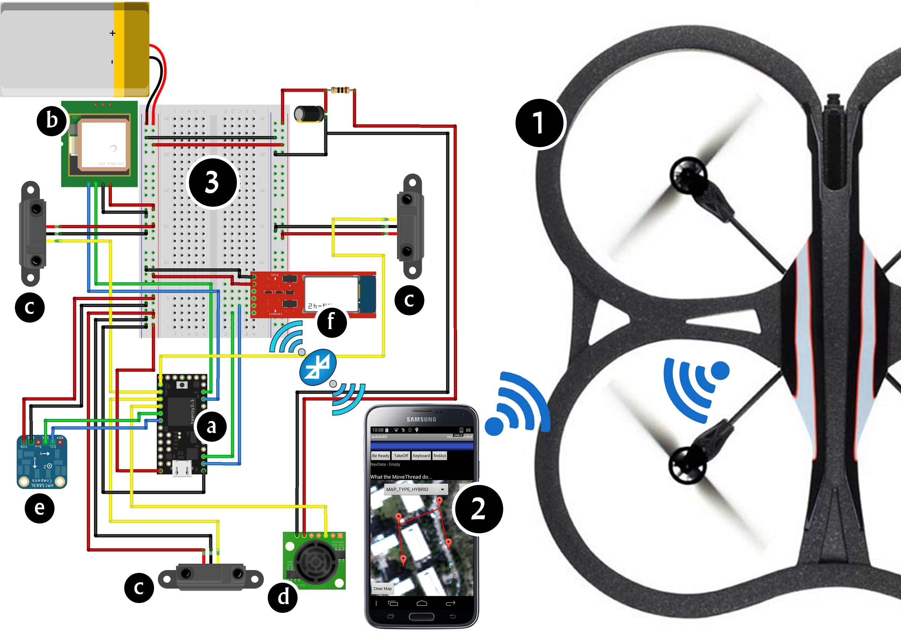

# finalproject

### The purpose 

The purpose of this paper, the autonomous navigator, is to upgrade the system manned aircraft available today.

### Targets

-	The UAV will operate autonomously without human intervention.
-	Autonomous navigator will help aircraft to perform the task while avoiding bumping into various obstacle.
-	This planned system adapted simplest UAV, which is easier and much smaller than the regular UAV (see accompanying diagram). So UAV will be able to make accurate and complete "quality jobs", which can not be perform by larger vessels.

### Components

The planned system includes four main components:
-	AR.Drone 2 - UAV (1).
-	Distance sensors - IR and Ultrasonic (c, d).
-	GPS component (b).
-	Flight controller - receives the data from the sensors and GPS and giving instructions UAV flight - Teensy 3.1 (a).
-	Commpass (e).
-	Bluetooth Module (f).

### Connection scheme

### Other

-	Link to our movie Project: [Autonomous UAV Project](https://www.youtube.com/watch?v=XlXc1ci40Bg)
-	The project was part of a BA at the University of Ariel in Samaria, Israel